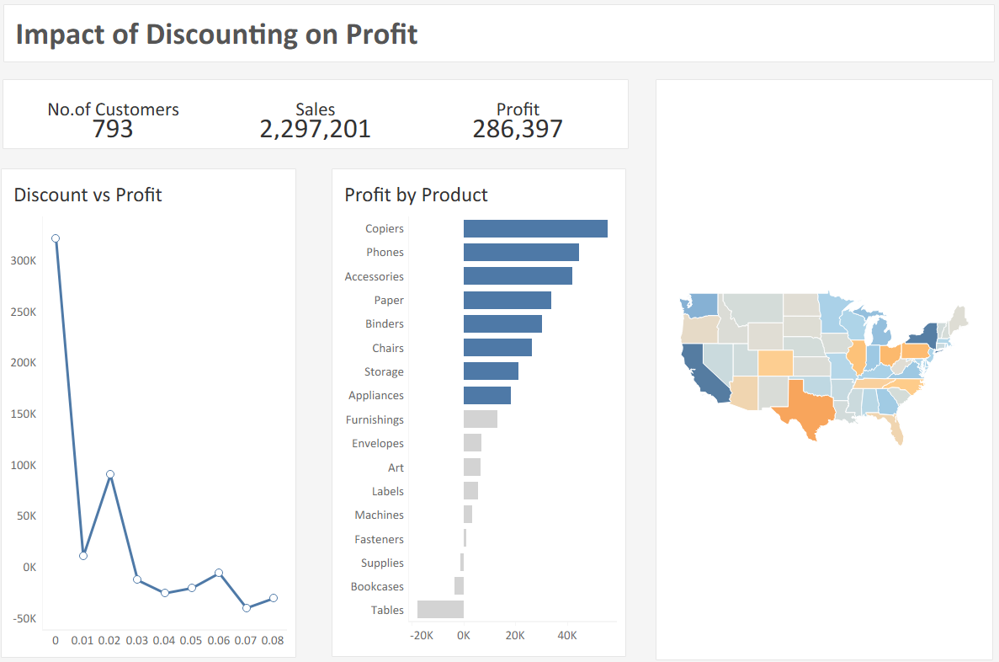

# Superstore Profitability Dashboard (Tableau)

## 📊 Project Overview
This Tableau project analyzes the profitability performance of a national-level retail chain using the Superstore dataset. It focuses on how discounting strategies impact profit margins, identifies underperforming product sub-categories, and surfaces actionable insights to guide pricing and sales strategies.

---

## 📌 Objectives & Methodology
- Identify product sub-categories that are eroding profit margins despite high sales
- Evaluate the relationship between discounting and profitability
- Surface actionable insights to inform pricing and sales performance strategy
- Provide a clear, executive-ready dashboard for data-driven decisions

---

## 🔍 Key Insights
- Product sub-categories like *Tables* are generating high sales but below-average profit margins
- Discounting beyond Tier 4 is strongly correlated with profit erosion
- High-loss states (Texas, Ohio, Pennsylvania) account for a ₹58,260 deficit, driven by over-discounting
- Sales-driven targets are incentivizing aggressive discounting at the cost of margin

---

## ✅ Recommendations
- Cap discounts at Tier 4 in competitive markets to preserve profit margins
- Shift employee incentives from sales volume to profit per transaction
- Improve cost structures via vendor renegotiations and logistics optimization
- Focus profitability-based KPIs in performance management

---

## 🖼️ Dashboard Preview
  
*Includes analysis of discount tiers, product-level profitability, and sales vs profit performance*

---

## 📂 Files Included
- `superstore-profitability-dashboard.twbx` – Tableau Packaged Workbook
- `/images` – Dashboard screenshots and visuals
- `README.md` – Project documentation

---

## 📌 Dataset
- **Source:** [Kaggle – Sample Superstore Dataset](https://www.kaggle.com/datasets/vivek468/superstore-dataset-final)
- Used under CC license for educational and demonstration purposes

---

## 🛠️ Tools Used
- Tableau Public
- Microsoft Excel (for minor data prep)
- GitHub (for version control and publishing)

---

## 📘 Notes
This project was developed as part of a self-led consulting simulation to demonstrate analytical thinking, dashboarding, and business recommendation skills using Tableau.
